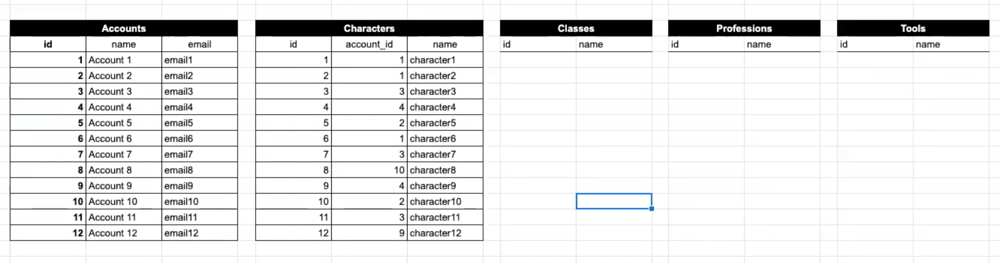
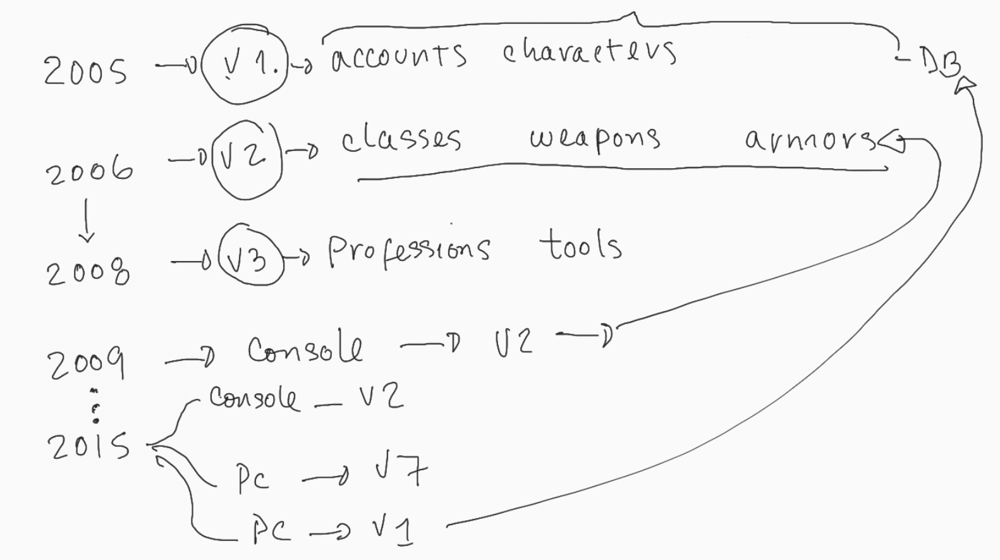
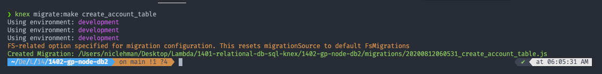

# Database Schema Design

Lambda School

- [Training kit](https://learn.lambdaschool.com/web4node/module/recFG7SqlSCAB8iU7#project)
- [Guided Lecture on YouTube](https://learn.lambdaschool.com/web4node/module/recFG7SqlSCAB8iU7#project)

## Mantras of Schema Design 🥝

1. _EVERY_ table must have a primary key
2. _EVERY_ change to the database schema (DB structure, not the data) must be down with a new migration

---

## Building out Tables

- What are tables would we need to create a multi-character game :question:

|          |             |            |
| :------: | :---------: | :--------: |
| accounts |   classes   | characters |
| weapons  | professions |   tools    |
|  armors  |   skills    | attributes |

- Start Creating some Tables



- every table must have a primary key 🥝
- these tables aren't connected, but we have enough to imagine how to build things and get started

- How we go from conceptual to actually adding a table to a database :question:

  - most tools we use will have something (GUI) that makes this easy

---

## Make Connecting to a Database Easy

:zap: Connecting to a Database :zap:

[Dbeaver](https://dbeaver.io/)

> Universal Database Tool > they said about themselves

- connect to SQLite

[SQLiteStudio](https://sqlitestudio.pl/)

> Create, edit, browse SQLite databases.

- client that connects to a database

[Postgres](https://www.postgresql.org/)

> The World's Most Advanced Open Source Relational Database

- Luis is using Postgres12 to run Postgres server on local machine

[pgAdmin](https://www.pgadmin.org/)

> pgAdmin is the most popular and feature rich Open Source administration and development platform for PostgreSQL

- comes with more than SQLite

  - `SQLite` : Tables + Views
  - `pgAdmin` : databases, login groups, tablespaces

- It takes a lot more to get going for server based databases compared to file based
  - this is the reason there's more stuff to in pgAdmin vs SQLite
- We will be using SQLite but get to know pgAdmin

---

## Databases over time

[ 20:00 - 30:00 ]



- as time goes on

  - adding new tables
  - manipulating old ones
  - splitting and using different versions of the database

  :memo: note this :memo:

  - `DB` version must be synchronous with the version of the code you are working on
  - What do I mean?
    - going back to fix bug in PC V1 codebase...load DB_v1
      - accounts
      - characters
    - console programmer working on v2...
      - accounts
      - characters
      - classes
      - weapons
    - PC web dev team ... v7 code & DB

- this versioning becomes a problem...
  - Its 2020 and you need to remember what the DB looked like in 2006
  - _this_ is what MIGRATIONS are for

---

## Migrations

[ 34:00 ]

- record every.damn.change to the database somewhere in the source code
- somewhat like Git version control

#### Knex has a Schema Builder

- keep a record of how to structure the database for _this_ specific version of code
- there is huge value in this and all companies _should_ see it
  - 5 years, 5 days down the road ... you'll be happy you know what v1431 looked like

---

---

## Lets get started

[ 26:00 - ]

### Install and init knex

`npm i -g knex`

`knex init`

- configuration file to tell knex how/where to find our database
- [knexfile.js](knexfile.js)

### Build Database v1

[ 45:00 - ]

Accounts

| id  | name | email  |
| :-: | :--: | :----: |
|  0  |  A1  | email1 |
|  1  |  A2  | email2 |
|  2  |  A3  | email3 |
| ... | ...  |  ...   |

Characters

| id  |  name  |
| :-: | :----: |
|  0  | char15 |
|  1  | char2  |
|  2  | char34 |
| ... |  ...   |

[Knex Docs](http://knexjs.org/#Schema-createTable) shows us how to us a query to create a table in SQLite ( and a ton of other things)

```d
knex.schema.createTable('users', function (table) {
  table.increments();
  table.string('name');
  table.timestamps();
})
Outputs:
create table `users` (`id` integer not null primary key autoincrement, `name` varchar(255), `created_at` datetime, `updated_at` datetime)
```

---

#### Our first Migration

Every change to Database Schema must be done using migrations 🥝

`knex migrate:make create_account_table`



- this creates a timestamped file in a migrations folder
- allows you to run it all in order again down the road
- no space after `migrate:` :eyes:

[ 51:30 - ] WATCH THIS FOR EXPLANATION of file created :eyes:

`migrate:make` >> migrations_folder >> timestamped_file :arrow_down:

```javascript
//  records the change to DB schema
exports.up = function (knex) {
  //  [1] & [2]
  return knex.schema.createTable("accounts", (tbl) => {
    tbl.increments("id"); // [1a]

    tbl.string("name", 256).notNullable().unique(); //  [1b]

    tbl.string("email", 256); //  [1c]
  });
  //  [1]
  //  id, name, email
  //  [a]
  //   id is primary key
  //  --> auto-increment the id automatically
  //  [b]
  //  make the name unique
  //  --> required
  //  --> not null
  //  [1c]
  //  email not required and not unique
  //  [2]
  //  the return is critical
  //  --> without it, the migration fails
};
```

record the change to DB schema

```javascript
//  describes how to undo the changes in the up() function
exports.down = function (knex) {
  return knex.schema.dropTableIfExists("");
};
```

:running_man: Run pending Migrations :running_woman:

`knex migrate:latest`

---

### Reviewing the Migration Process

1. terminal : `knex mmigrate:make create_something_here`

2. editor : update migration file `up()` and `down()`

3. terminal: `knex migrate:latest`

   How do you undo changes:question:

   - run the down() funciton...

4. terminal: `knex migrate:rollback`

---


